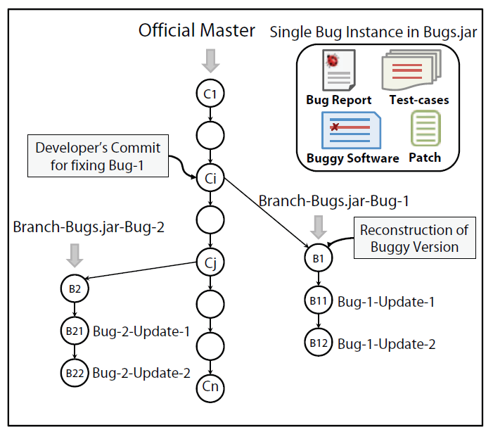

# Bugs.jar: A Large-scale, Diverse Dataset of Real-world Java Bugs

### Authors: Ripon K. Saha, Yingjun Lyu, Wing Lam, Hiroaki Yoshida, Mukul R. Prasad
### Link: http://winglam2.web.engr.illinois.edu/publications/2018/bugs-dot-jar.pdf

## Abstract
This paper aims to mine large Java software repositories and build large-scale Java bugs dataset. The dataset is larger than Defects4J. The structure of this dataset is different from that of Defects4j. The authors showed some cases of usage including ELIXIR, Ekstazi and JaCoCo.

## Background
Defects4J is the most widely used Java bugs dataset for tasks like fault localization, program repair, mutation testing, etc. But Defects4j v1.2 only contains 6 subject programs and they are mostly libraries.

## Approach
### Projects Selection
From Apached Foundation: real-world relevance
Top 8 groups of different categories: diversity criterion
Large enough (with large amount of commits and loc): real-world relevance
Use maven as build system and JUnit as test framework:

### Bugs Filtering
Identifying bug-fixing commits -> Consistently reproducible bug-fixes -> Manual verification

### Structure to extend the dataset
Tree datastructure.

## Use Cases
The authors tried JaCoCo, Ekstazi, and ELIXIR on the new dataset.

## Challenges
It could be tricky to specify configurations, for example, libraries.