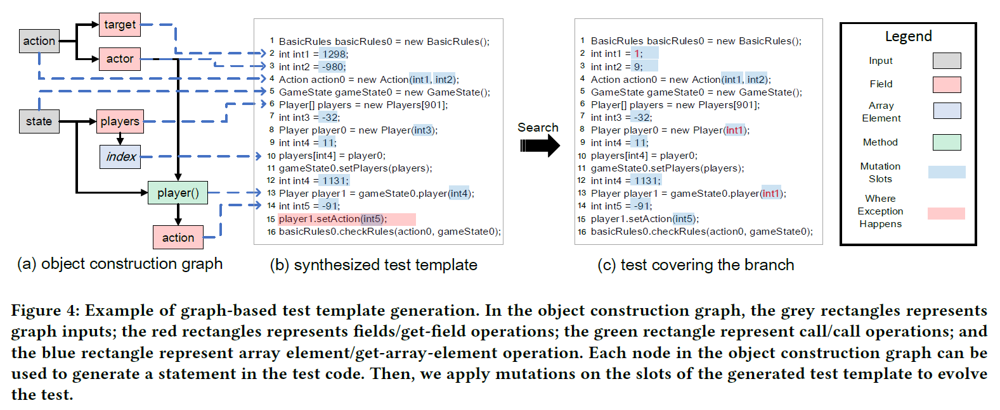
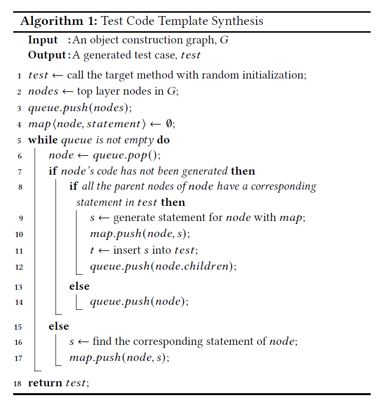

# FSE'21 Graph-Based Seed Object Synthesis for Search-Based Unit Testing

### Authors: Yun Lin, You Sheng Ong, Jun Sun, Gordon Fraser, Jin Song Dong
### Link: http://linyun.info/publications/fse21.pdf

## Abstract
This study focuses on improving SBST(search-based software testing) by creating legitimate objects ultilizing graph information.

## Background
### Search-based software testing
- Target: leverage meta-heuristic algorithms to cover test various goals (e.g., coverage of different levels). The earlist technique is to generate test cases for funcions with parameters of **primitive type**.
- Barrier: when moving to OO language, it's difficult for tools to generate legitimate objects. For example, if you want to test a method `foo(A object_a, B object_b)`, you have to generate object of class A and B respectively. Otherwise you can't cover the majority of the method.
### Object Construction
- Existing solutions: SBST heuristics, symbolic execution, separation logics.
    - SBST heuristics: explore **subclasses** and diversify the object constuction means (Evosuite has implemented that). But this is just like random guess and try.
    - symbolic execution & separation logic: extract object constraints with SMT solvers.

## Intuition
- Failure of creating legitimate object parameters will lead to the damage of *continuity* and *monotonicity* of search space of SBST.
- Objects inputs can be synthesized by analyzing **static control** and **data flow**.
- Object Construction Graph:
    - rectangle: variable
    - edge: dataflow relation

- Graph-based Template Synthesis and Seaerch Valuation:
    - Based on Object Construction Graph, we can construct a test seed template where eah node in the graph corresponds to a statement in the test template.

## Approach
### 1. Build Object Construction Graph
1.1 Object Construction Graphs. G(b) = &lt;I, N, E&gt;.

    I: the set of graph inputs
    N: the set of variables
    E: the set of information flows for constructing one variable based on other variables
    vertex_A -> vertax_B: variable B is a property describing the state of variable A.
1.2 Constructing Object Construction Graphs. Detailed example: https://sites.google.com/view/evoobj/home. 
### 2. Graph-Based Test Code Synthesis
2.1 Code Skeleton Synthesis

2.2 Code Element Synthesis
### 3. Integration to SBST

## Evaluation & Conclusion
- EvoObj significantly outperforms EvoSuite interms of coverage.
- Challenge: Large object construction graphs can incur large runtime overhead and may increase the risk for runtime exceptions. The longer the test, the more likely it results in unexpected runtime exceptions. **(This could be where can be improved!)**
- In order to cover a deeply nested branch, a test with sufficient statements to set all the relevante objects state is necessary. EvoObj only conducts static taint analysis (which favors completeness over soundness). So there could be more variables being cosidered than required. Dynamic taint analyis could be considered.